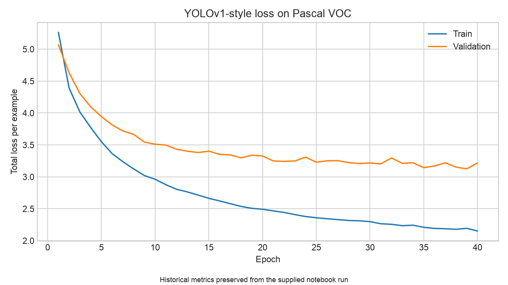

# Pascal VOC YOLO Detector

[](https://github.com/volkthienpreecha/pascal-voc-yolo-detector/actions/workflows/ci.yml)

A PyTorch implementation of a YOLOv1-style object detector for Pascal VOC. The project covers the full detection path: VOC annotation encoding, a ResNet-50 feature backbone, grid predictions, decomposed YOLO loss, box decoding, and deterministic class-aware non-max suppression.



## Highlights

- Explicit 7×7 target-grid construction for the 20 Pascal VOC classes.
- Vectorized IoU and responsible-box assignment.
- Inspectable classification, localization, and confidence losses.
- Injectable feature backbone for lightweight CPU tests.
- Stable class-aware NMS with portable prediction artifacts.
- CUDA, Apple Metal, and CPU device selection.

## Detection representation

Each grid cell outputs two bounding boxes and 20 class probabilities:

```text
[confidence, x, y, width, height] × 2 + [20 class probabilities]
```

The `x` and `y` values locate a box center inside its grid cell. Width and height are normalized to the image. During training, the highest-IoU box predictor becomes responsible for an occupied cell.

The objective combines:

1. class-probability squared error for occupied cells;
2. center and square-root size error for responsible boxes;
3. confidence error for object and no-object boxes.

## Recorded experiment

The historical notebook run trained for 40 epochs with a ResNet-50 feature extractor. Total validation loss reached **3.1255 at epoch 39**. The source experiment did not calculate precision, recall, or mean average precision, so this repository deliberately makes no mAP claim.

The current package uses a compact dense detection head to make local experimentation and testing more practical. The preserved curve describes the supplied historical notebook configuration and is not presented as a benchmark for modified settings.

## Setup

Python 3.10 or newer is required.

```bash
python -m venv .venv
source .venv/bin/activate
python -m pip install -e ".[dev]"
```

## Train

The first run downloads Pascal VOC 2007 and ImageNet-pretrained ResNet-50 weights.

```bash
voc-yolo-train \
  --device auto \
  --data-dir data/voc \
  --epochs 40 \
  --batch-size 7 \
  --output-dir runs/yolo
```

Run `voc-yolo-train --help` for all configuration options.

## Use the components

```python
import torch
from pascal_voc_yolo.loss import yolo_loss
from pascal_voc_yolo.postprocess import decode_predictions, non_max_suppression

predictions = torch.rand(1, 7, 7, 30)
targets = torch.zeros_like(predictions)
losses = yolo_loss(predictions, targets)

detections = decode_predictions(predictions[0], score_threshold=0.2)
filtered = non_max_suppression(detections, iou_threshold=0.5, score_threshold=0.2)
```

## Prediction artifact

[`artifacts/sample_predictions.csv`](artifacts/sample_predictions.csv) contains 1,545 historical detections across all 20 VOC classes.

| Column | Meaning |
|---|---|
| `data_num` | Source image index |
| `class_label` / `class_num` | VOC class name and ID |
| `x1`, `y1`, `x2`, `y2` | Absolute box corners in pixels |

The normalizer validates class ranges, finite values, and coordinate ordering. Rebuild the portable file with:

```bash
PYTHONPATH=src python scripts/normalize_predictions.py raw.csv artifacts/sample_predictions.csv
```

## Walkthrough

[`notebooks/pascal_voc_yolo_walkthrough.ipynb`](notebooks/pascal_voc_yolo_walkthrough.ipynb) explains target encoding, loss components, model output, NMS, and the preserved run. Expensive training is disabled by default.

## Repository structure

```text
src/pascal_voc_yolo/     model, data adapter, loss, postprocessing, and CLI
tests/                   synthetic geometry, loss, model, NMS, and artifact tests
notebooks/               curated project walkthrough
artifacts/               historical losses and portable predictions
scripts/                 artifact conversion utility
```

## Test

```bash
python -m pytest -q
python -m ruff check src tests scripts
```

Tests do not download VOC or pretrained weights.

## Limitations

- No mAP evaluation was recorded with the supplied outputs.
- VOC boxes are encoded one object per cell, matching YOLOv1's limitation.
- Trained checkpoints and raw datasets are intentionally excluded.
- Full training is GPU-intensive and is not run in CI.

## References

- J. Redmon et al., [You Only Look Once: Unified, Real-Time Object Detection](https://arxiv.org/abs/1506.02640), 2015.
- M. Everingham et al., [The Pascal Visual Object Classes Challenge](http://host.robots.ox.ac.uk/pascal/VOC/).
- K. He et al., [Deep Residual Learning for Image Recognition](https://arxiv.org/abs/1512.03385), 2015.
- [PyTorch](https://pytorch.org/) and [torchvision](https://pytorch.org/vision/stable/).

## Provenance

The detector implementation and recorded experiment began as academic computer-vision work and were subsequently cleaned, tested, and packaged for reproducible public presentation. Classroom prompts, grading utilities, and submission code are intentionally excluded.
